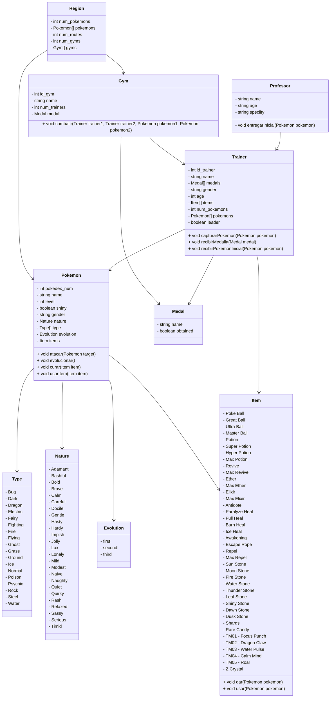

```mermaid

classDiagram

class Region{
    - int num_pokemons
    - Pokemon[] pokemons
    - int num_routes
    - int num_gyms
    - Gym[] gyms
}

class Gym{
    - int id_gym
    - string name
    - int num_trainers
    - Medal medal
    + void combatir(Trainer trainer1, Trainer trainer2, Pokemon pokemon1, Pokemon pokemon2)
}

class Pokemon{
    - int pokedex_num
    - string name
    - int level
    - boolean shiny
    - string gender
    - Nature nature
    - Type[] type
    - Evolution evolution
    - Item items
    + void atacar(Pokemon target)
    + void evolucionar()
    + void curar(Item item)
    + void usarItem(Item item)
}

class Type{
    - Bug
    - Dark
    - Dragon
    - Electric
    - Fairy
    - Fighting
    - Fire
    - Flying
    - Ghost
    - Grass
    - Ground
    - Ice
    - Normal
    - Poison
    - Psychic
    - Rock
    - Steel
    - Water
}

class Nature{
    - Adamant
    - Bashful
    - Bold
    - Brave
    - Calm
    - Careful
    - Docile
    - Gentle
    - Hasty
    - Hardy
    - Impish
    - Jolly
    - Lax
    - Lonely
    - Mild
    - Modest
    - Naive
    - Naughty
    - Quiet
    - Quirky
    - Rash
    - Relaxed
    - Sassy
    - Serious
    - Timid
}

class Evolution{
    - first
    - second
    - third
}


class Medal{
    - string name
    - boolean obtained
}


class Trainer{
    - int id_trainer
    - string name
    - Medal[] medals
    - string gender
    - int age
    - Item[] items
    - int num_pokemons
    - Pokemon[] pokemons
    - boolean leader
    + void capturarPokemon(Pokemon pokemon)
    + void recibirMedalla(Medal medal)
    + void recibirPokemonInicial(Pokemon pokemon)
}

class Professor{
    - string name
    - string age
    - string specilty
    - void entregarInicial(Pokemon pokemon)
}

class Item {
    - Poke Ball
    - Great Ball
    - Ultra Ball
    - Master Ball
    - Potion
    - Super Potion
    - Hyper Potion
    - Max Potion
    - Revive
    - Max Revive
    - Ether
    - Max Ether
    - Elixir
    - Max Elixir
    - Antidote
    - Paralyze Heal
    - Full Heal
    - Burn Heal
    - Ice Heal
    - Awakening
    - Escape Rope
    - Repel
    - Max Repel
    - Sun Stone
    - Moon Stone
    - Fire Stone
    - Water Stone
    - Thunder Stone
    - Leaf Stone
    - Shiny Stone
    - Dawn Stone
    - Dusk Stone
    - Shards
    - Rare Candy
    - TM01 - Focus Punch
    - TM02 - Dragon Claw
    - TM03 - Water Pulse
    - TM04 - Calm Mind
    - TM05 - Roar
    - Z Crystal
    + void dar(Pokemon pokemon)
    + void usar(Pokemon pokemon)
}


%%% Relaciones entre clases %%%

    Region --> Pokemon
    Region --> Gym

    Pokemon --> Type
    Pokemon --> Nature
    Pokemon --> Evolution
    Pokemon --> Item

    Gym --> Medal
    Gym --> Trainer

    Trainer --> Pokemon
    Trainer --> Medal
    Trainer --> Item

    

    

    Professor --> Trainer
```

